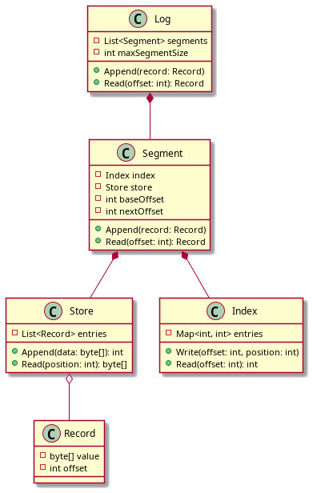

# Distributed Logging System

## Overview

This repository contains the implementation of a distributed logging system designed to efficiently manage and store log entries. The system is modular and built using best practices for performance, reliability, and scalability.

## Features

- **Log Management**: Handles multiple segments for efficient data storage.
- **Indexing**: Maintains an index for quick retrieval of log entries.
- **Storage**: Implements a store to persist records efficiently.
- **Data Retrieval**: Provides methods to append and read log entries.

## Logs Architecture

The architecture of the distributed logging system consists of the following components:

- **Log**: The main entry point that manages segments.
- **Segment**: Responsible for storing records and maintaining an index.
- **Index**: Maps offsets to positions within the store for quick access.
- **Store**: The persistent storage layer that holds the actual log entries.
- **Record**: Represents a single log entry, containing the value and its offset.




## Getting Started

### Prerequisites

- Go 1.13+
- Kubernetes 1.16+

### Installation

1. Clone the repository:
   ```bash
   git clone <repository-url>
   cd <repository-directory>
   ```
2 Build the application:
  ```bash
  // not deployed to GCP yet !!
  ```
### Contributing
- Contributions are welcome! Please open an issue or submit a pull request.
### License
- This project is licensed under the MIT License. See the LICENSE file for details.
